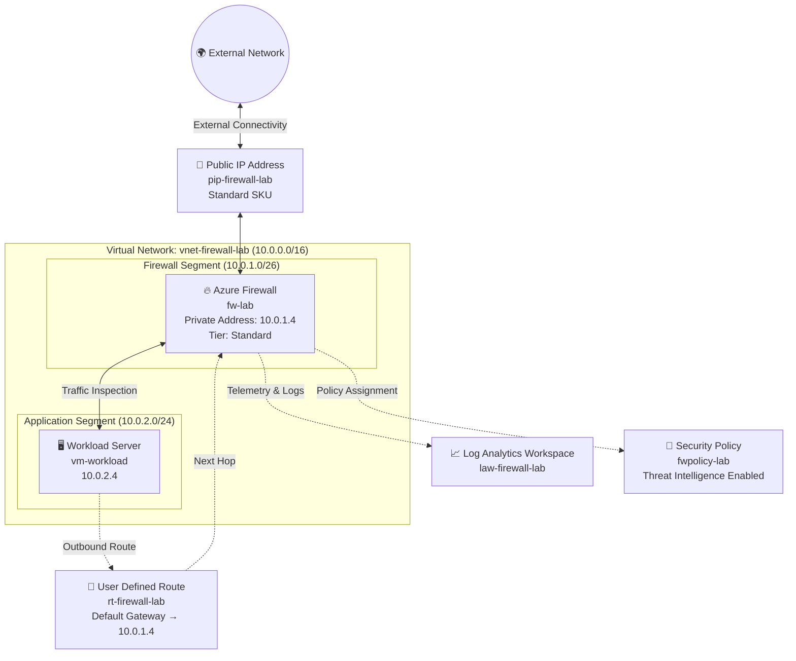

# Azure Firewall Implementation Blueprint

## Infrastructure Layout Overview



---

# Network Segmentation Strategy

The virtual network is divided into dedicated segments to separate security services from application workloads and improve traffic control.

| Network Segment       | Address Space | Function                                            |
| --------------------- | ------------- | --------------------------------------------------- |
| `AzureFirewallSubnet` | `10.0.1.0/26` | Reserved subnet hosting the Azure Firewall service  |
| `WorkloadSubnet`      | `10.0.2.0/24` | Contains virtual machines and application resources |

### Firewall Subnet Sizing Considerations

Azure Firewall requires a subnet size of at least `/26`. This allocation ensures sufficient address capacity for service scaling, maintenance operations, and backend infrastructure requirements.

---

# Outbound Communication Path

Traffic originating from the workload server follows a controlled path before reaching external destinations.

```text
Workload VM (10.0.2.4)
        │
        ▼
User Defined Route (0.0.0.0/0)
        │
        ▼
Azure Firewall (10.0.1.4)
        │
        ├─ Application Rule Evaluation
        ├─ Network Rule Evaluation
        ├─ Threat Intelligence Inspection
        │
        ▼
Public IP Address
        │
        ▼
Internet
```

### Processing Sequence

1. The workload VM generates outbound traffic.
2. A User Defined Route redirects traffic to Azure Firewall.
3. Azure Firewall evaluates traffic against application and network policies.
4. Threat Intelligence checks are performed.
5. Approved traffic exits through the firewall public IP address.

---

# Inbound Access Workflow

External requests are securely forwarded to internal services using Destination Network Address Translation (DNAT).

```text
External Client
       │
       ▼
Public IP Address:8080
       │
       ▼
Azure Firewall DNAT Rule
       │
       ▼
Internal VM (10.0.2.4:80)
```

### DNAT Operation

When a request arrives on port 8080 of the firewall's public IP address, Azure Firewall rewrites the destination information and forwards the traffic to port 80 on the internal workload server.

---

# Multi-Layer Security Framework

The deployment incorporates several security mechanisms that work together to regulate network traffic.

```text
┌──────────────────────────────────────────────────────┐
│                DEFENSE-IN-DEPTH MODEL                │
├──────────────────────────────────────────────────────┤
│ Layer 1 – Threat Intelligence Filtering             │
│ • Detects malicious IP addresses and domains        │
│ • Enforces Alert and Deny actions                   │
├──────────────────────────────────────────────────────┤
│ Layer 2 – Application-Level Controls                │
│ • Permits approved Microsoft services               │
│ • Permits approved GitHub services                  │
│ • Blocks unauthorized web destinations              │
├──────────────────────────────────────────────────────┤
│ Layer 3 – Network Access Controls                   │
│ • Allows approved DNS communication                 │
│ • Supports diagnostic ICMP traffic                  │
│ • Rejects non-approved network connections          │
├──────────────────────────────────────────────────────┤
│ Layer 4 – Destination NAT Services                  │
│ • Maps external requests to internal resources      │
│ • Limits exposure to approved service ports         │
└──────────────────────────────────────────────────────┘
```

---

# Architectural Choices and Justifications

| Implementation Choice            | Business and Technical Justification                                                        |
| -------------------------------- | ------------------------------------------------------------------------------------------- |
| Azure Firewall Standard Tier     | Provides advanced traffic filtering, application rules, and Threat Intelligence integration |
| Centralized Security Gateway     | Simplifies administration by enforcing security controls from a single location             |
| User Defined Routing             | Ensures all outbound traffic is inspected before reaching external destinations             |
| Firewall Policy-Based Management | Delivers improved scalability and centralized policy governance                             |
| Standard Public IP Deployment    | Mandatory requirement for Azure Firewall Standard implementations                           |

---

# Security Governance Approach

The environment was designed according to the principle of least privilege, ensuring only required communication paths are permitted.

### Security Controls Implemented

* Traffic is denied by default unless explicitly authorized.
* Outbound web access is restricted to approved domains through application rules.
* Threat Intelligence protection blocks communication with known malicious destinations.
* Network rules limit access to approved protocols, ports, and endpoints.
* DNAT exposes only designated services rather than the entire virtual machine.

### Security Benefits

* Reduced attack surface.
* Improved visibility of network activity.
* Stronger control over outbound internet access.
* Protection against known malicious infrastructure.
* Controlled exposure of internal workloads to external users.

---

# Solution Summary

This architecture establishes Azure Firewall as the central security enforcement point within the virtual network. By combining routing controls, application filtering, network policies, Threat Intelligence, and DNAT functionality, the environment delivers secure connectivity while maintaining strict control over both inbound and outbound traffic flows. The design aligns with cloud security best practices and supports a least-privilege operating model.
